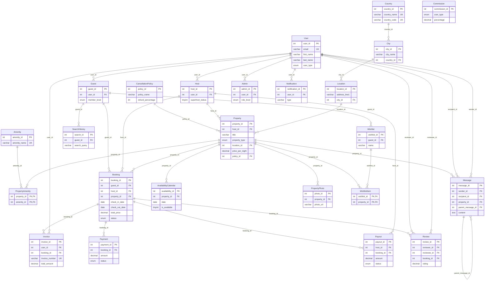

# Airbnb-Style Booking Platform: Relational Data Mart (MySQL)

A normalised MySQL 8 database for a short-term rental platform like Airbnb: users, hosts and guests, properties, availability, bookings, payments, payouts, invoices, reviews, messaging and wishlists. It comes with realistic sample data and a set of analytical SQL queries.

Built for the IU University of Applied Sciences course project **"Build a Data Mart in SQL"** (grade: 1.3).

| | |
|---|---|
| **Tables** | 24 |
| **Foreign keys** | 32 |
| **Sample rows** | 516 |
| **Database** | MySQL 8 (InnoDB, utf8mb4) |

## Entity-relationship diagram



A static version is in [`er_diagram.png`](er_diagram.png).

## Design decisions

- **One `User` table with role tables.** `Host`, `Guest` and `Admin` each link 1:1 to `User` through a unique `user_id`. Login data lives in one place, while role-specific fields (superhost status, membership level, admin department) stay in their own tables. One person can be both a host and a guest.
- **Normalised addresses (3NF).** `Location → City → Country` avoids repeating city and country names on every property.
- **Many-to-many relationships through junction tables.** `PropertyAmenity` and `WishlistItem` use composite primary keys, so the same amenity or property can't be added twice.
- **Integrity rules in the database, not only in the app:**
  - `ENUM` types for statuses (`pending / confirmed / cancelled / completed`, payment methods, property types)
  - `CHECK (rating BETWEEN 1 AND 5)` on reviews
  - `UNIQUE (property_id, date)` on the availability calendar, so a date can't be listed twice
  - unique emails, invoice numbers and country codes
- **Deliberate delete behaviour.** Dependent data (photos, amenities, wishlist items, availability) uses `ON DELETE CASCADE`. Financial records (bookings, payments, payouts, invoices) keep the default `RESTRICT`, so they can't be deleted by accident.
- **Message threads.** `Message.parent_message_id` references `Message` itself, so replies form a thread.
- **Commission history.** `Commission` keeps old rates with an `is_active` flag instead of overwriting them.

## Analytical queries

[`queries.sql`](queries.sql) contains 11 queries using joins across up to 5 tables, aggregation, window functions (`RANK`, running totals, share of total) and subqueries:

| # | Business question |
|---|---|
| Q1 | Revenue by country and city |
| Q2 | Booking status breakdown and cancellation rate |
| Q3 | Top 5 properties by revenue, nights booked and average nightly rate |
| Q4 | Average rating per property type |
| Q5 | Platform economics: guest invoice vs. host payout vs. platform margin |
| Q6 | Payment methods: volume, share and failures |
| Q7 | Monthly revenue with a running total |
| Q8 | Top-spending guests within each membership level |
| Q9 | Most common amenities and their average nightly price |
| Q10 | Search: properties available on a date for 4+ guests, with photo |
| Q11 | Data-quality check on a denormalised field |

### Example results (from the sample data)

**Q1. Revenue by city (top 5)**

| Country | City | Bookings | Revenue (€) |
|---|---|---:|---:|
| United States | Los Angeles | 1 | 5,000 |
| Germany | Munich | 2 | 2,925 |
| Germany | Berlin | 2 | 1,840 |
| Netherlands | Amsterdam | 1 | 1,540 |
| Italy | Rome | 1 | 1,400 |

**Q5. Platform economics.** Guests are invoiced the booking price plus 10%, and hosts are paid out 90%. So the platform keeps **18.2% of each invoice**, for example €1,000 on the €5,500 Hollywood Hills booking.

**Q7. Monthly revenue with running total**

| Month | Revenue (€) | Running total (€) |
|---|---:|---:|
| 2026-05 | 4,415 | 4,415 |
| 2026-06 | 1,400 | 5,815 |
| 2026-07 | 1,540 | 7,355 |
| 2026-08 | 5,000 | 12,355 |
| 2026-09 | 2,125 | 14,480 |
| 2026-10 | 3,225 | 17,705 |
| 2026-12 | 930 | 18,635 |

**Q11. Data-quality check.** `Booking.host_id` is stored for faster lookups even though it can be derived from `Property.host_id`. That's a deliberate denormalisation, so it needs monitoring. On the generated sample data, this check flags 11 bookings where the two values differ. In production, the fix would be a trigger or dropping the redundant column.

## How to run

Requirements: MySQL 8.0 or newer.

```bash
git clone https://github.com/Pritamhaldertech/airbnb-data-mart.git
cd airbnb-data-mart
mysql -u root -p < schema_and_data.sql      # creates the airbnbdb database with all tables and data
mysql -u root -p -t < queries.sql           # runs all analytical queries
```

Or, in MySQL Workbench: **File → Open SQL Script** → `schema_and_data.sql` → run it (⚡), then do the same with `queries.sql`.

All data is fictional sample data.

## Project structure

```
airbnb-data-mart/
├── schema_and_data.sql   # all 24 tables with keys, constraints and sample data
├── queries.sql           # 11 analytical queries
└── er_diagram.png        # ER diagram
```

## Author

Pritam Halder · [Portfolio](https://pritamhaldertech.github.io) · [LinkedIn](https://www.linkedin.com/in/pritamhaldertech)
